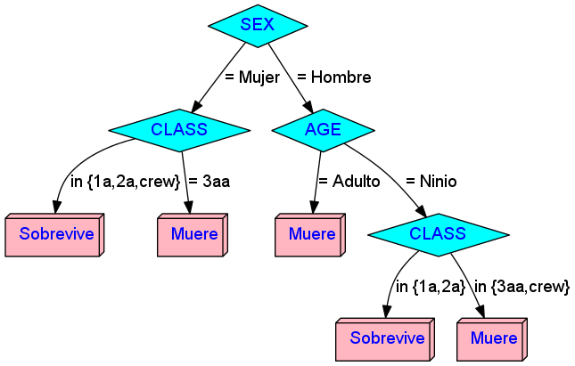
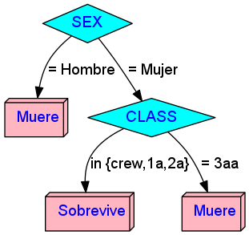
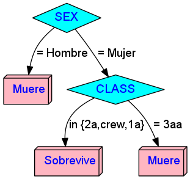

# decision-trees

In this repo I use decision trees to solve several well-known machine learning problems.

## Titanic

### Model 1

**Rules**:

Rule 1: (981/146, lift 1.3)
	AGE = Adulto
	SEX = Hombre
	->  class Muere  [0.850]

Rule 2: (681/153, lift 1.1)
	CLASS = 3aa
	->  class Muere  [0.775]

Rule 3: (30, lift 3.0)
	CLASS in {1a, 2a}
	AGE = Ninio
	->  class Sobrevive  [0.969]

Rule 4: (251/17, lift 2.9)
	CLASS in {1a, 2a}
	SEX = Mujer
	->  class Sobrevive  [0.929]

### Model 2

**Rules:**

Rule 1: (1150/244, lift 1.2)
	SEX = Hombre
	->  class Muere  [0.787]

Rule 2: (457/113, lift 1.1)
	CLASS = 3aa
	->  class Muere  [0.752]

Rule 3: (188/17, lift 2.8)
	CLASS in {crew, 1a, 2a}
	SEX = Mujer
	->  class Sobrevive  [0.905]

### Model 3

*Rules:*

Rule 1: (1163/244, lift 1.2)
	SEX = Hombre
	->  class Muere  [0.790]

Rule 2: (483/127, lift 1.1)
	CLASS = 3aa
	->  class Muere  [0.736]

Rule 3: (178/13, lift 2.9)
	CLASS in {2a, crew, 1a}
	SEX = Mujer
	->  class Sobrevive  [0.922]
 
 
**Note**: *Model 2 and 3 are effectively the same.* 
